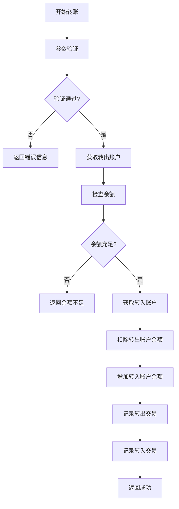

# ECO账户转账功能实现总结

## 📊 **功能概述**

为 `AccountServiceImpl` 添加了ECO账户之间的转账功能，支持用户之间进行ECO代币转账。

## 🔧 **实现内容**

### **1. 创建转账命令类**

**文件**: `AccountTransferCmd.java`

```java
@Data
public class AccountTransferCmd {
    private String fromWalletAddress;  // 转出钱包地址
    private String toWalletAddress;    // 转入钱包地址
    private String amount;             // 转账数量
    private String order;              // 订单号
    private String remark;             // 备注
}
```

### **2. 添加交易类型枚举**

**文件**: `AccountTransactionType.java`

```java
TRANSFER_OUT("TRANSFER_OUT", "转出"),
TRANSFER_IN("TRANSFER_IN", "转入");
```

### **3. 接口方法定义**

**文件**: `AccountService.java`

```java
/**
 * ECO账户转账
 */
SingleResponse<Void> transferEco(AccountTransferCmd accountTransferCmd);
```

### **4. 核心实现方法**

**文件**: `AccountServiceImpl.java`

```java
@Override
@Retryable(value = OptimisticLockingFailureException.class, maxAttempts = 3, backoff = @Backoff(delay = 100))
@Transactional(isolation = Isolation.REPEATABLE_READ, rollbackFor = Exception.class)
public SingleResponse<Void> transferEco(AccountTransferCmd accountTransferCmd) {
    // 完整的转账实现逻辑
}
```

## 🚀 **核心功能特性**

### **1. 参数验证**
- 转出钱包地址不能为空
- 转入钱包地址不能为空
- 转账金额不能为空且必须大于0
- 转出和转入钱包地址不能相同

### **2. 账户管理**
- 自动获取或创建转出账户（ECO类型）
- 自动获取或创建转入账户（ECO类型）
- 检查转出账户余额是否充足

### **3. 事务安全**
- 使用 `@Transactional` 确保原子性
- 使用 `@Retryable` 处理乐观锁冲突
- 使用 `REPEATABLE_READ` 隔离级别

### **4. 交易记录**
- 记录转出交易（TRANSFER_OUT）
- 记录转入交易（TRANSFER_IN）
- 包含完整的交易前后余额信息
- 支持备注信息

### **5. 订单管理**
- 自动生成订单号（如果未提供）
- 使用相同订单号关联转出和转入交易

## 📊 **转账流程**



## 🔒 **安全特性**

### **1. 乐观锁机制**
```java
@Retryable(value = OptimisticLockingFailureException.class, maxAttempts = 3, backoff = @Backoff(delay = 100))
```

### **2. 事务回滚**
- 任何步骤失败都会自动回滚
- 确保数据一致性

### **3. 余额检查**
```java
if (fromBalance.compareTo(transferAmount) < 0) {
    return SingleResponse.buildFailure("转出账户ECO余额不足");
}
```

### **4. 参数验证**
- 完整的输入参数验证
- 防止无效操作

## 📝 **使用示例**

### **API调用示例**
```java
AccountTransferCmd transferCmd = new AccountTransferCmd();
transferCmd.setFromWalletAddress("0x1234...");
transferCmd.setToWalletAddress("0x5678...");
transferCmd.setAmount("100.50");
transferCmd.setRemark("转账备注");

SingleResponse<Void> response = accountService.transferEco(transferCmd);
if (response.isSuccess()) {
    // 转账成功
} else {
    // 处理错误
    String errorMessage = response.getErrMessage();
}
```

### **数据库记录示例**

**转出交易记录**:
```sql
INSERT INTO account_transaction (
    wallet_address, account_id, transaction_type, 
    number, before_number, after_number, 
    account_type, status, `order`, remark
) VALUES (
    '0x1234...', 1, 'TRANSFER_OUT',
    '100.50', '1000.00', '899.50',
    'ECO', 'SUCCESS', 'TRANSFER_1234567890', '转账备注'
);
```

**转入交易记录**:
```sql
INSERT INTO account_transaction (
    wallet_address, account_id, transaction_type, 
    number, before_number, after_number, 
    account_type, status, `order`, remark
) VALUES (
    '0x5678...', 2, 'TRANSFER_IN',
    '100.50', '500.00', '600.50',
    'ECO', 'SUCCESS', 'TRANSFER_1234567890', '转账备注'
);
```

## ✅ **技术特点**

1. **原子性**: 使用数据库事务确保转账操作的原子性
2. **一致性**: 转出和转入操作要么全部成功，要么全部失败
3. **隔离性**: 使用REPEATABLE_READ隔离级别防止并发问题
4. **持久性**: 所有操作都会持久化到数据库
5. **可重试**: 乐观锁冲突时自动重试
6. **可追踪**: 完整的交易记录便于审计

## 🎯 **业务价值**

- **用户体验**: 支持用户之间直接转账，提升用户体验
- **资金流动**: 促进ECO代币在用户间的流通
- **系统完整性**: 完善了账户系统的功能
- **数据安全**: 确保转账操作的安全性和可靠性

## 🔧 **扩展建议**

1. **手续费支持**: 可以添加转账手续费功能
2. **转账限制**: 可以添加单笔转账限额和日限额
3. **转账审批**: 可以添加大额转账审批流程
4. **批量转账**: 可以支持批量转账功能
5. **转账状态**: 可以添加转账状态跟踪

ECO账户转账功能已成功实现，提供了安全、可靠的用户间转账服务！
